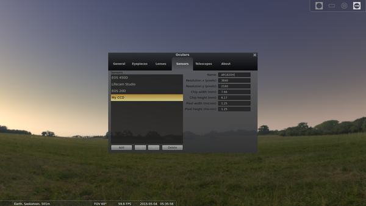

# Stellarium

## About
Stellarium is astonomy simulation software.

## Demo
<iframe width="560" height="315" src="https://www.youtube.com/embed/zgvNB_A5OGY" frameborder="0" allowfullscreen></iframe>
([watch on YouTube](https://www.youtube.com/v/zgvNB_A5OGY) to see it in HD)

## Seatures
Stellarium can do these things:

* Virtual planetarium
* Telescope control
* Eyepiece view simulator

### Screenshots
Here is what it looks like:

---

This is what code looks like:

<pre><code class="python"># Calculating square roots by Newton's method, inspired by SICP
#   http://mitpress.mit.edu/sicp/full-text/book/book-Z-H-10.html#%_sec_1.1.7

def sqrt(x):
    def average(a, b):
        return (a + b) / 2.0

    def is_good_enough(guess):
        return (abs((guess * guess) - x) < 0.001)

    def improve(guess):
        return average(guess, x / guess)

    def sqrt_iter(guess):
        if is_good_enough(guess):
            return guess
        else:
            return sqrt_iter(improve(guess))

    return sqrt_iter(1.0)

ans = sqrt(9)
</code></pre>